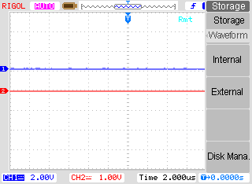

# LinuxOscilloscope
LinuxOscilloscope (LO) is a very simple application with an aim to controll various oscilloscopes under Linux and Windows operating systems.

# Abilities
LO can connect to a oscilloscope via RS232 (not implemented YET), TCP/IP or USB interface. Requirements fro oscilloscopes:
- for USB: Oscilloscope must be comatible with USBTMC protocol, Linux OS should recognize it as /dev/usbtmc* device.
- for TCP/IP: Oscilloscope must support SCPI protocol.
- for RS232: **not implemented yet**

LO is compatible with these oscilloscopes:
- Rigol DS1102E (USB)
- Tektronix DPO 4104B (TCP & USB)
- Tektronix DPO 4032B (TCP & USB)

By pressing a button **Autoconnect**, LO can detect which one of oscilloscopes is attached.

# Extending of LO

If you want to add other oscilloscope, you need to write a wrapper class and place it into /Devices folder. LO will automatically detect a new class and a device will appear in a connect dialog.

# FUN
LO can save data directly into USB flash drive, attached to an oscilloscope itself.
For Rigol, LO simulates key-press:

