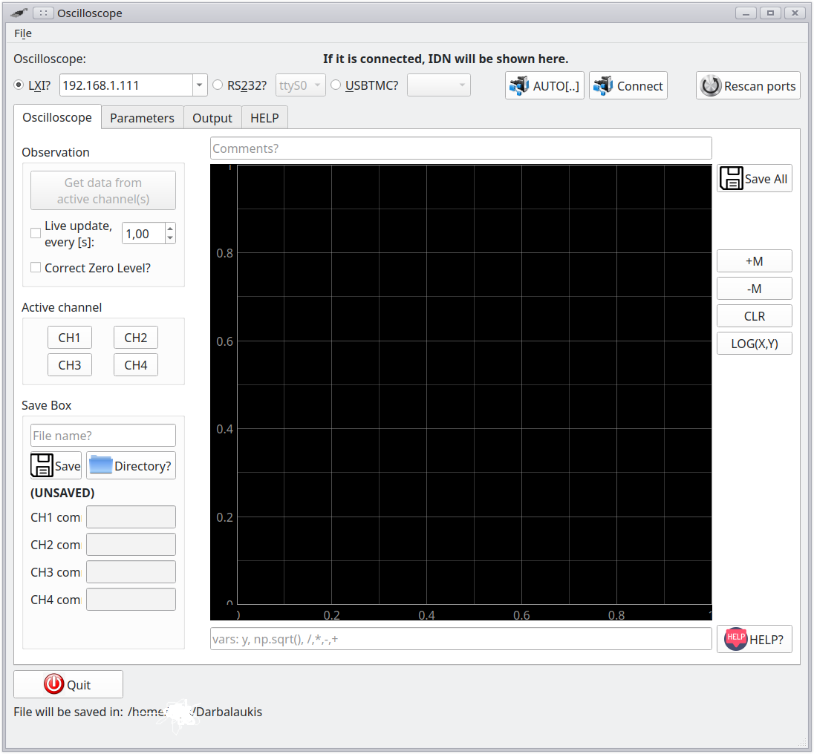

# LinuxOscilloscope
LinuxOscilloscope (LO) is a very simple application with an aim to control various oscilloscopes under Linux and Windows operating systems.

# Capabilities
LO can connect to a oscilloscope via RS232 (not implemented YET), TCP/IP or USB interface. Requirements for the oscilloscopes:
- for USB: Oscilloscope must be compatible with USBTMC protocol, Linux OS should recognize it as /dev/usbtmc* device.
- for TCP/IP: Oscilloscope must support SCPI protocol (LXI-compatible).
- for RS232: **not implemented yet**

LO is compatible with these oscilloscopes:
- Rigol DS1102E (USB)
- Tektronix DPO 4104B (TCP & USB)
- Tektronix DPO 4032B (TCP & USB)

By pressing a button **Auto connect**, LO can detect which one of oscilloscopes is attached.

# Basic control

In order to connect to an oscilloscope, specify a port at first: LXI for TCP/IP -  IP address, or USBTMC, or RS232.
**Auto connect** feature - **LO** tries to connect to an oscilloscope, read IDN, guess a wrapper from this IDN.
**Connect** - LO shows a dialog, wherein you can choose a correct wrapper.
Implemented wrappers:
- DEMO: 4 channels, random generated signals, for testing purposes.
- Rigol DS1102E (USB)
- Tektronix DPO 4104B TCP
- Tektronix DPO 4104B USB
- Tektronix DPO 4032B TCP
- Tektronix DPO 4032B USB

**LO** gets data just from active channels - at first, you need to activate at least one. Is it possible to obtain data continuously, by checking a box *Live update*.

*correct zero level* - feature useful to TOF/XTOF measurements. If you don't know anything about TOF or XTOF - this feature is useless for you.
It subtracts a part of signal from a whole signal. A part is on left side of trigger.

A simple math can be done with a signal(s): multiplication, subtraction, division ...:
$$ y\cdot np.pi \cdot 25 $$
where - y: signal from a channel. this equation will be applied onto all signals from all channels!
It is possible to use `numpy` functions from `numpy` module, aliased as `np`.
There is no possible to combine signals like this: $CH1 \cdot CH2$ <-- It is not possible.

# Extending of LO

If you want to add other oscilloscope, you need to write a wrapper class and place it into /Devices folder. LO will automatically detect a new class and a device will appear in a connect dialog.

# FUN
LO can save data directly into USB flash drive, attached to an oscilloscope itself.
For Rigol, LO simulates key-press:
(It supports just lower case letters. Upper case letters are not implemented yet)

